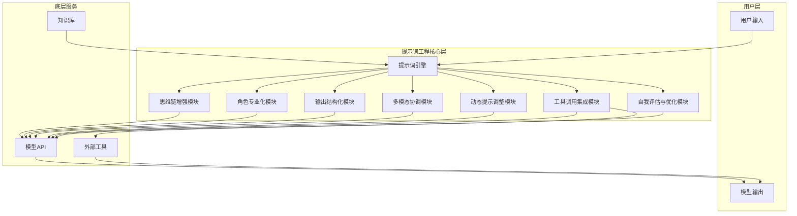

# Chat提示词工程功能规格说明文档

## 1. 文档目的

本文档旨在设计适合chat应用的提示词工程功能，基于参考文件中的核心概念和框架，提供详细的功能规格说明，以便开发团队能够理解和实现这些功能。

## 2. 核心问题与功能目标

### 2.1 解决的核心问题

1. **可控性与稳定性** - 减少模型输出的随机性，确保复杂任务中结果的一致性
2. **多步骤推理优化** - 解决需要多轮思考、验证的复杂问题（如数学证明、代码调试）
3. **上下文效率** - 在有限token内最大化信息密度，处理长文档和复杂对话
4. **领域适配性** - 快速适应专业领域（医疗、法律、编程）的术语和逻辑
5. **偏见与安全** - 通过结构化提示减少有害内容生成，增加伦理约束

### 2.2 功能目标

1. **思维链增强** - 实现“逐步思考-验证-修正”的闭环流程
2. **角色专业化** - 通过系统提示创建特定领域专家角色（如“资深算法工程师”）
3. **输出结构化** - 强制JSON、XML等格式输出便于程序化处理
4. **多模态协调** - 协调文本、图像、代码的混合生成任务
5. **动态提示调整** - 根据对话历史自动优化后续提示策略
6. **工具调用集成** - 嵌入API调用、数据库查询等外部工具使用
7. **自我评估与优化** - 模型自我评估并迭代优化输出

## 3. 功能架构设计

### 3.1 整体架构



### 3.2 模块设计

#### 3.2.1 思维链增强模块

**功能描述**：实现逐步思考-验证-修正的闭环流程，支持多条推理链和树状推理路径。

**实现方案**：
- **Self-Consistency CoT**：生成多条推理链，通过投票机制选择最佳答案
- **Tree of Thoughts (ToT)**：实现树状探索多个推理路径，支持回溯机制
- **Least-to-Most**：将复杂问题分解为渐进子问题链，逐步解决

**技术实现**：
```python
# 思维链生成函数
def generate_chain_of_thought(prompt, max_chains=3):
    chains = []
    for i in range(max_chains):
        chain = model.generate(f"{prompt}\n\nLet me think step by step:")
        chains.append(chain)
    return chains

# 投票选择最佳答案
def select_best_answer(chains):
    # 实现投票逻辑
    pass
```

#### 3.2.2 角色专业化模块

**功能描述**：通过系统提示创建特定领域专家角色，提高模型在特定领域的表现。

**实现方案**：
- 预定义多个专业角色模板（如医生、律师、工程师等）
- 允许用户自定义角色，设置角色名称、专业领域、背景信息等
- 为不同角色提供特定的系统提示，优化模型行为

**技术实现**：
```python
# 角色模板
def get_role_template(role_name):
    templates = {
        "doctor": "You are a senior medical doctor specializing in internal medicine...",
        "engineer": "You are a senior software engineer with 10+ years of experience...",
        "lawyer": "You are a professional lawyer specializing in contract law..."
    }
    return templates.get(role_name, "You are a helpful assistant.")

# 生成角色系统提示
def generate_role_prompt(role_name, custom_info=None):
    template = get_role_template(role_name)
    if custom_info:
        template += f"\n\n{custom_info}"
    return template
```

#### 3.2.3 输出结构化模块

**功能描述**：强制JSON、XML等格式输出，便于程序化处理。

**实现方案**：
- 支持JSON、XML等格式的强制输出
- 提供Schema定义工具，确保输出符合预期结构
- 实现自动验证和重试机制，处理格式错误

**技术实现**：
```python
# 生成结构化输出提示
def generate_structured_output_prompt(prompt, output_format="json", schema=None):
    format_instruction = f"\n\nPlease output your response in {output_format} format."
    if schema:
        format_instruction += f"\n\nSchema: {schema}"
    return prompt + format_instruction

# 验证输出格式
def validate_output(output, expected_format="json"):
    # 实现验证逻辑
    pass
```

#### 3.2.4 多模态协调模块

**功能描述**：协调文本、图像、代码的混合生成任务。

**实现方案**：
- 支持多模态输入（文本+图像）
- 支持多模态输出（文本+代码+图像描述）
- 实现模态间的协调和转换

**技术实现**：
```python
# 处理多模态输入
def process_multimodal_input(text, image_url=None):
    if image_url:
        # 处理图像输入
        image_description = model.describe_image(image_url)
        return f"{text}\n\nImage description: {image_description}"
    return text

# 生成多模态输出
def generate_multimodal_output(prompt, include_code=False, include_image_desc=False):
    # 实现多模态输出逻辑
    pass
```

#### 3.2.5 动态提示调整模块

**功能描述**：根据对话历史自动优化后续提示策略。

**实现方案**：
- 分析对话历史，识别用户意图和上下文
- 基于历史交互自动调整提示策略
- 实现提示词的动态优化和个性化

**技术实现**：
```python
# 分析对话历史
def analyze_conversation_history(history):
    # 实现对话历史分析逻辑
    pass

# 动态调整提示
def adjust_prompt_based_on_history(prompt, history):
    analysis = analyze_conversation_history(history)
    # 根据分析结果调整提示
    return adjusted_prompt
```

#### 3.2.6 工具调用集成模块

**功能描述**：嵌入API调用、数据库查询等外部工具使用。

**实现方案**：
- 集成搜索、计算器、API等外部工具
- 实现工具调用的安全验证和错误处理
- 支持工具调用结果的自然语言解释

**技术实现**：
```python
# 工具调用提示生成
def generate_tool_call_prompt(prompt, tools):
    tool_instruction = "\n\nYou can use the following tools to help answer the question:"
    for tool in tools:
        tool_instruction += f"\n- {tool.name}: {tool.description}"
    return prompt + tool_instruction

# 执行工具调用
def execute_tool_call(tool_name, parameters):
    # 实现工具调用逻辑
    pass
```

#### 3.2.7 自我评估与优化模块

**功能描述**：模型自我评估并迭代优化输出。

**实现方案**：
- 实现模型自我评估机制，评估输出质量
- 基于评估结果迭代优化输出
- 支持从错误中学习，避免重复失败

**技术实现**：
```python
# 自我评估
def self_evaluate(output, prompt):
    evaluation_prompt = f"\n\nPlease evaluate the quality of the following response to the prompt:\n\nPrompt: {prompt}\n\nResponse: {output}\n\nEvaluation criteria: accuracy, completeness, relevance, clarity"
    evaluation = model.generate(evaluation_prompt)
    return evaluation

# 迭代优化
def optimize_output(output, evaluation, prompt):
    # 实现基于评估的优化逻辑
    pass
```

## 4. 实现路径

### 4.1 前端实现

**功能**：
- 提供提示词工程功能的用户界面
- 支持角色选择和自定义
- 支持输出格式设置
- 显示思维链和工具调用过程

**技术栈**：
- Vue 3 + TypeScript
- Pinia for state management
- Axios for API calls

### 4.2 后端实现

**功能**：
- 实现提示词工程核心逻辑
- 与模型API交互
- 集成外部工具
- 处理多模态输入输出

**技术栈**：
- Go
- RESTful API
- Redis for caching

### 4.3 数据存储

**功能**：
- 存储用户自定义角色和提示模板
- 存储对话历史和提示优化记录
- 存储工具调用配置和结果

**技术栈**：
- PostgreSQL
- Redis for caching

## 5. 性能优化

### 5.1 提示词优化

- 减少提示词长度，提高token使用效率
- 优化提示词结构，提高模型理解度
- 实现提示词缓存，避免重复生成

### 5.2 推理优化

- 实现批处理，减少API调用次数
- 优化思维链生成策略，减少推理时间
- 实现并行推理，提高多链生成速度

### 5.3 系统优化

- 实现请求队列，避免系统过载
- 优化数据库查询，提高数据访问速度
- 实现缓存机制，减少重复计算

## 6. 安全考虑

### 6.1 输入验证

- 验证用户输入，防止注入攻击
- 限制输入长度，避免token滥用
- 过滤有害内容，确保输出安全

### 6.2 工具调用安全

- 验证工具调用权限，防止未授权访问
- 限制工具调用频率，避免资源滥用
- 监控工具调用行为，检测异常操作

### 6.3 数据安全

- 加密存储用户数据和对话历史
- 实现访问控制，保护敏感信息
- 定期清理过期数据，减少安全风险

## 7. 测试策略

### 7.1 功能测试

- 测试各模块功能是否正常
- 测试不同角色和输出格式的表现
- 测试工具调用和多模态协调功能

### 7.2 性能测试

- 测试提示词生成速度
- 测试推理链生成性能
- 测试系统响应时间

### 7.3 安全测试

- 测试输入验证和过滤功能
- 测试工具调用安全机制
- 测试数据安全措施

## 8. 部署计划

### 8.1 环境要求

- 前端：Node.js 18+
- 后端：Go 1.20+
- 数据库：PostgreSQL 14+
- 缓存：Redis 7+

### 8.2 部署步骤

1. 部署前端应用到Web服务器
2. 部署后端服务到应用服务器
3. 配置数据库和缓存
4. 配置API密钥和环境变量
5. 启动服务并进行测试

## 9. 未来扩展

### 9.1 功能扩展

- 支持更多专业领域的角色模板
- 集成更多外部工具和API
- 实现更高级的推理框架

### 9.2 技术扩展

- 支持更多模型和API
- 实现分布式推理，提高性能
- 支持边缘部署，减少延迟

### 9.3 生态扩展

- 开放提示词模板市场，允许用户分享和购买模板
- 建立提示词工程社区，促进知识共享
- 提供提示词工程培训和认证

## 10. 结论

本功能规格说明文档详细设计了适合chat应用的提示词工程功能，基于参考文件中的核心概念和框架，提供了完整的功能架构和实现方案。通过实现这些功能，chat应用将能够提供更智能、更可控、更专业的交互体验，满足用户在不同场景下的需求。